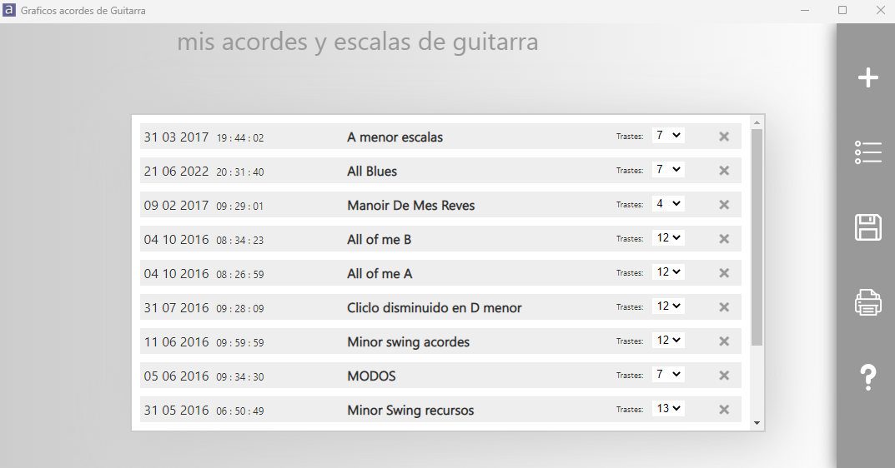
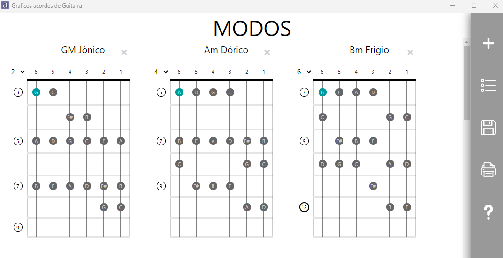
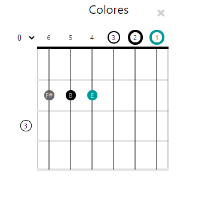

## acordes de guitarra
Aplicación de escritorio para windws programada con , que permite crear de una manera sencilla graficos que representan un mastil de guitarra de seis cuerdas, en el que se pueden colocar a modo de puntos de colores la posicion de las pulsaciones.
### Pantalla principal

### Pantalla de edición

### Marcas de mastil
